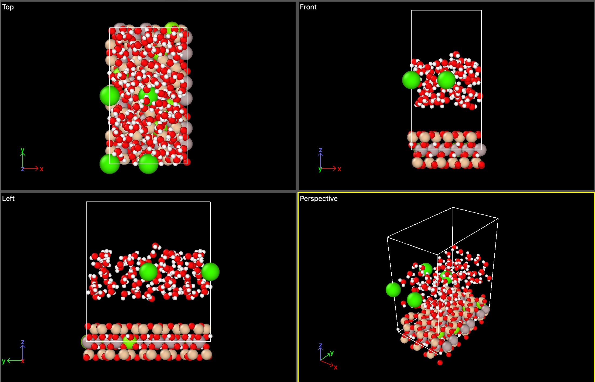

```
 _  _  _  _  _  _  _  _  _  _  _  _  _  _  _  _  _  _  _  _ _ 
(_)(_)(_)(_)(_)(_)(_)(_)(_)(_)(_)(_)(_)(_)(_)(_)(_)(_)(_)(_)(_)
(_)                                                         (_)
(_) _        _    __  __ __  __ ____  ____    __  __ _____  (_)
(_)| |      / \  |  \/  |  \/  |  _ \/ ___|  |  \/  |_   _| (_)
(_)| |     / _ \ | |\/| | |\/| | |_) \___ \  | |\/| | | |   (_)
(_)| |___ / ___ \| |  | | |  | |  __/ ___) | | |  | | | |   (_)
(_)|_____/_/_  \_\_|  |_|_|  |_|_| __|____/  |_|__|_| |_|   (_)
(_)|  _ \  / \|_   _|/ \    |  ___|_ _| |   | ____|         (_)
(_)| | | |/ _ \ | | / _ \   | |_   | || |   |  _|           (_)
(_)| |_| / ___ \| |/ ___ \  |  _|  | || |___| |___          (_)
(_)|____/_/___\_\_/_/ __\_\ |_|_  |___|_____|_____| ____    (_)
(_) / ___| ____| \ | | ____|  _ \    / \|_   _/ _ \|  _ \   (_)
(_)| |  _|  _| |  \| |  _| | |_) |  / _ \ | || | | | |_) |  (_)
(_)| |_| | |___| |\  | |___|  _ <  / ___ \| || |_| |  _ <   (_)
(_) \____|_____|_| \_|_____|_| \_\/_/   \_\_| \___/|_| \_\  (_)
(_) _  _  _  _  _  _  _  _  _  _  _  _  _  _  _  _  _  _  _ (_)
(_)(_)(_)(_)(_)(_)(_)(_)(_)(_)(_)(_)(_)(_)(_)(_)(_)(_)(_)(_)(_)
```

# LAMMPS MT DATA FILE GENERATOR FOR BACHELORPROJECT

Understanding clays, namely smectites, can might give insight into the origin of life. It has been shown that amino acid may adsorb to the surface area of the clay within the interlayer space, particulary on Montmorrilonite (MT). Molecular Dynamic simulations can give greater insight. A forcefield called 'CLAYFF' works particulary well for clay simulations, and works together with CVFF. This forcefield requires LAMMPS to run the simulation. For this simulation to be ran, a .DATA file is necessary, storing all information and parameters of the required system. Using an Object Oriented approach with python, this code helps to easily generate a .DATA file, with various parameters and options.

***

### STRUCTURE

Here is a visualization of the most important folders and files:

- **/code**: contains all python code
  - **/code/main_runner.py**: contains the program initiation 
    - **/code/classes/**: contains all the classes the program uses to work
    - **/code/classes/SystemParts.py**: contains all the system entity objects that need to be filled
    - **/code/classes/\*.py**: the rest contains the other major classes to process fill this up
- **/unitcell**: contains the .xyz file(s) for the starting unit cell
- **/water**: contains files nessecary for adding water solvent based of GROMACS spc2016
- **/forcefields**: contains the .frc raw forcefield files
- **/misc**: contains miscelanious items (tests, unused functions, banner)
- **/output**: place where the .data files are stored after the code is done running

***

### CLASSES

#### ALL SYSTEM PARTS DEFINING THE SYSTEM
- `Molecule`: contains atoms and all sorts of bonds [*]
- `Atom`: contains element, position and specific force field atom<br>

- `Bond`: atoms involved and used bond coefficient
- `Angle`: atoms involved and used angle coefficient
- `Torsion`: atoms involved and used torsion (dihedral) coefficient
- `Improper`: atoms involved and improper bond coefficient<br>

- `FF_atom`: contains specific characterstics read from the forcefield<br>

- `FF_pair_coef`: information on specific pair intereaction for one FF_atom based on forcefield
- `FF_bond_coef`: information on bond specific bond definition based on forcefield
- `FF_angle_coef`: information on bond specific angle definition based on forcefield
- `FF_torsion_coef`: information on bond specific torsion definition based on forcefield
- `FF_improper_coef`: information on bond specific improper definition based on forcefield

#### INITIALISATION
- `SystemBuilder`: builds the system by replicating it, creating a specified height for the interlayer space, adding ions to specified ratio, adding mg substitutes by specified ratio, and solvating it.
- `WaterBuilder`: creates the solvent within the interlayer space of the clay based on the GROMACS method, using specified vdw radii

#### PROCESSING
- `ForceFieldLoader`: reads all specified .frc files and creates FF objects. All FF_atom.type's are made unique (i.e. 'ao' 'oh')
- `SystemAllocator`: hardcoded functions to allocate right FF_Atom to specific atoms. Bonds, angles, (torsions, impropers) are then automatically created based on cutoff distance within each molecule. This part contains the only hardcoded section.

#### WRITING OUT
- `SystemWriter`: Gives all processed data an unique identifyer, stores the information in the system based on the right LAMMPS .data file order, and then writes out the data file<br>

[*] Note: The word 'Molecule' is used to distinct different entities in the system, but in reality not all entities are molecules (like the clay)

***

### USAGE

- Specify your parameters manually within python main.py:

```python
if __name__ == "__main__":
    main(input_file =       'STx_prot',     
         replication =      (4,4), 
         height =           30,
         al_mg_ratio =      7.1702509,     
         ca_si_ratio =      0.055125,      
         
         water_file =       'spc216',
         vdw_radii_file =   'vdwradaii',
         vdw_def_radius =    1.05,         
         vdw_def_scale =     5.70,          

         ff_files =         ['clayff', 
                             'cvff'],
         mg_cutoff =        2.0,        
         h_cutoff =         1.0,       
         bond_cutoff =      1.5,      

         ff_params =        ['ao', 
                             'mgo', 
                             'st', 
                             'ho', 
                             'ob', 
                             'ohs', 
                             'obos', 
                             'oh', 
                             'Ca', 
                             'o*',         
                             'h*'          
                            ])   
```

- It then shows the logo followed by a message after it is finished creating the output file
- By a system larger than 4x4, a loading icon is being shown
- When writing 'python main.py <number>' in cmd line, it should run a <number> x <number> replication system with the other settings within python.py

***

### EXAMPLE OUTPUT

#### .DATA file vizualised in ovito

<div align="center">
    
</div>

### .DATA file as text

```
# --------------------------------------------------------------
# Generated DATA file using 'LAMMPS MT DATA FILE GENERATOR'
#
# Input file:                STx_prot
# Replication:               3x3
# Interlayer height:         30 Angstroms
# Al/Mg Ratio:               7.1702509
# Ca/Si Ratio:               0.055125
# Water file used:           spc216
# vdW radii file:            vdwradaii
# Default vdW radius:        1.05
# Default vdW scale:         5.7
# Force fields used:         clayff, cvff
# Mg cutoff distance:        2.0 Angstroms
# H cutoff distance:         1.0 Angstroms
# Bond cutoff distance:      1.5 Angstroms
# Force field parameters:
#                            - ao
#                            - mgo
#                            - st
#                            - ho
#                            - ob
#                            - ohs
#                            - obos
#                            - oh
#                            - Ca
#                            - o*
#                            - h*
# --------------------------------------------------------------

673 atoms
242 bonds
103 angles
0 dihedrals
0 impropers

11 atom types
3 bond types
1 angle types
0 dihedral types
0 improper types

0.0                  15.036000000000001   xlo xhi
0.0                  26.499000000000002   ylo yhi
3.3645000000000005   33.3645              zlo zhi


Masses

1 	1.00797 	# hydroxyl H
2 	1.00797 	# spc water H
3 	15.9994 	# hydroxyl O sub.
4 	15.9994 	# hydroxyl O
5 	15.9994 	# bridging oxygen
6 	15.9994 	# spc water O
7 	15.9994 	# oxygen oct. sub.
8 	24.305  	# octahedral magnesium
9 	26.98154	# octahedral aluminum
10	28.0855 	# tetrahedral silicon
11	40.0798 	# calcium ion

Pair Coeffs

1 	0                     	0                 
2 	0                     	0                 
3 	0.15541641243934298   	3.1655200879296763
4 	0.15541641243934298   	3.1655200879296763
5 	0.15541641243934298   	3.1655200879296763
6 	0.15541641243934298   	3.1655200879296763
7 	0.15541641243934298   	3.1655200879296763
8 	9.030188046212057e-07 	5.2643258688466785
9 	1.3297460139101476e-06	4.271321931583935 
10	1.8401795462816938e-06	3.301956625198346 
11	0.09999999803260586   	2.8719902023628787

Bond Coeffs

1	553.935	1.0
2	553.935	1.0
3	553.935	1.0

Angle Coeffs

1	45.753	109.47

Atoms

1  	1  	5 	-1.05  	0.4710000000000001  	2.644              	4.4300000000000015  
2  	1  	4 	-0.95  	1.107               	7.099              	2.3640000000000008  
3  	1  	5 	-1.05  	0.08099999999999996 	5.4239999999999995 	4.431000000000001   
4  	1  	1 	0.425  	1.5619999999999998  	6.313              	2.170000000000001   
5  	1  	10	2.1    	0.32600000000000007 	2.5169999999999995 	6.068000000000001   
6  	1  	10	2.1    	0.258               	5.483              	6.069000000000001   
7  	1  	5 	-1.05  	0.010999999999999677	3.9919999999999995 	6.721000000000001   
8  	1  	10	2.1    	1.3039999999999998  	0.8300000000000001 	0.660000000000001   
9  	1  	10	2.1    	1.236               	3.796              	0.6610000000000005  
10 	1  	10	2.1    	3.9                 	5.337              	0.660000000000001   
11 	1  	5 	-1.05  	4.9879999999999995  	0.35499999999999954	0.21700000000000053 
12 	1  	5 	-1.05  	1.5499999999999998  	2.3209999999999997 	0.008000000000000895
13 	1  	5 	-1.05  	2.392               	4.8629999999999995 	0.21700000000000053 
14 	1  	5 	-1.05  	5.0120000000000005  	4.326              	0.0                 
15 	1  	5 	-1.05  	4.146               	6.827999999999999  	0.008000000000000895
16 	1  	9 	1.575  	2.078               	2.404              	3.3630000000000004  
17 	1  	9 	1.575  	4.676               	3.909              	3.3660000000000005  
18 	1  	9 	1.575  	4.6739999999999995  	6.911              	3.3630000000000004  
...           
667	104	6 	-0.82  	10.200000000000001  	22.129999999999995 	16.2045             
668	104	2 	0.41   	11.190000000000001  	22.019999999999996 	16.1145             
669	104	2 	0.41   	9.8                 	21.269999999999996 	16.5245             
670	105	11	2.0    	0.0                 	0.0                	18.3645             
671	106	11	2.0    	7.518000000000001   	0.0                	18.3645             
672	107	11	2.0    	0.0                 	13.249500000000001 	18.3645             
673	108	11	2.0    	7.518000000000001   	13.249500000000001 	18.3645             

Bonds

1  	3	2  	4  
2  	3	22 	27 
3  	3	23 	28 
4  	3	26 	119
5  	3	39 	66 
6  	1	42 	44 
7  	3	62 	67 
8  	3	63 	68 
9  	1	79 	106
10 	3	82 	84 
11 	3	102	107
12 	3	103	108
13 	3	122	124
...
240	2	664	666
241	2	667	668
242	2	667	669

Angles

1  	1	362	361	363
2  	1	365	364	366
3  	1	368	367	369
...
101	1	662	661	663
102	1	665	664	666
103	1	668	667	669

```


### AUTHOR
- Salomé Poulain